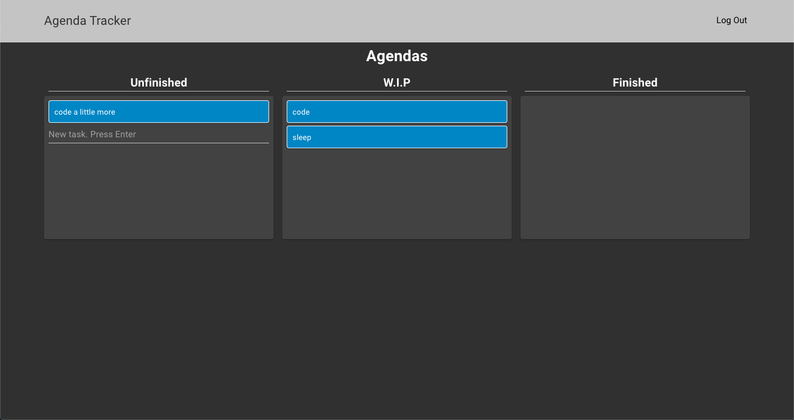

# 📄 React Agenda Tracker

React application for keeping track of agendas with drag and drop capabilities. 

*Note: For optimal performance, please utilize on Google Chrome. Styling is supported for Mobile and Web Browser*

* [Deployed Version](https://agenda-tracker.herokuapp.com/)

# Current Features
* Users can view their agenda
* Users can add new tasks
* Users can organize tasks based on Unfinished, W.I.P (work in progress), or Finished through drag and drop feature
* Users can delete tasks only once they have dragged it to Finished

# Built With
* React
* Webpack
* Babel
* Redux
* SCSS

# Tools
* React Router
* Firebase
* Material UI
* React-Beautiful-Dnd

For dark theme: refer to [Leizl Samano :)](https://levelup.gitconnected.com/material-ui-how-to-implement-dark-mode-and-edit-theme-colors-effcfa0893b9)

# Authors
* Reinald Reynoso